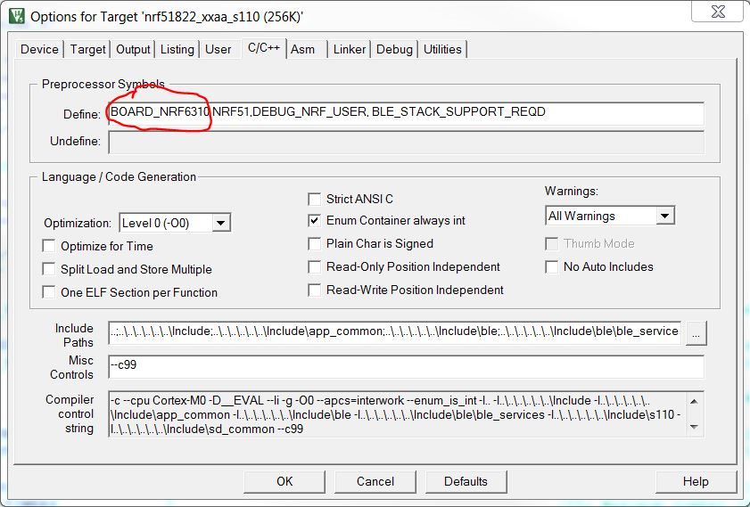

ble_app_uart-example
==================

This project contains code examples that show nrf51 UART functionality with the app_uart library.
Instructions on how to operate the example is given at the top of the main file in the example.
 
Requirements
------------
- nRF51 SDK version 6.1.0
- S110 SoftDevice version 7.0.0
- nRF51822 Development Kit version 2.1.0 or later

To compile it, clone the repository in the \nrf51822\Board\nrf6310\S110\ folder.

To port the example to the nRF51822 evaluation kit (PCA10001 board), simply replace the BOARD_NRF6310 constant define in KEIL -> Target Options to BOARD_PCA10001

The project may need modifications to work with other versions or other boards. 

About this project
------------------
This application is one of several applications that has been built by the support team at Nordic Semiconductor, as a demo of some particular feature or use case. It has not necessarily been thoroughly tested, so there might be unknown issues. It is hence provided as-is, without any warranty. 

However, in the hope that it still may be useful also for others than the ones we initially wrote it for, we've chosen to distribute it here on GitHub. 

The application is built to be used with the official nRF51 SDK, that can be downloaded from https://www.nordicsemi.no, provided you have a product key for one of our kits.

Please post any questions about this project on https://devzone.nordicsemi.com.
